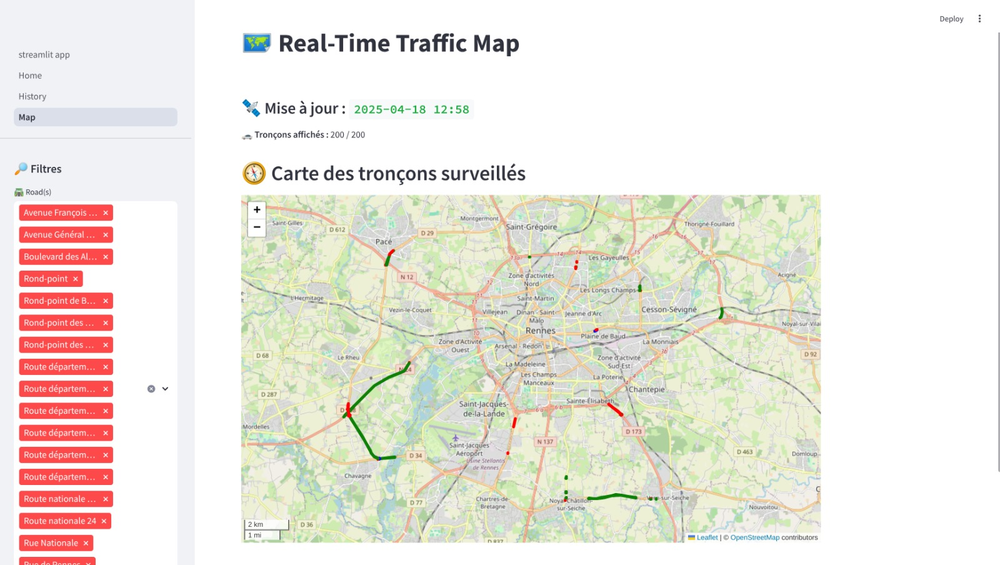

# FlowTrack: Real-Time Road Traffic Monitoring

## Overview
This project delivers a comprehensive real-time road traffic monitoring solution by leveraging modern streaming technologies, data pipelines, and visualization tools. It empowers users to monitor, analyze, and visualize urban traffic data in real-time, providing actionable insights to enhance mobility and reduce congestion.

---



---

## Features
- **Real-Time Data Ingestion**  
  Collect traffic data from APIs and stream it to AWS Kinesis, S3, or local storage for further processing.

- **Data Processing**  
  Utilize Apache Spark to process and transform raw traffic data into meaningful insights.

- **Visualization Dashboard**  
  Build an interactive dashboard with Streamlit to display real-time traffic insights and analytics.

- **Scalable Architecture**  
  Designed to handle large-scale traffic data using containerized services with Docker.


## Architecture Overview
1. **Data Sources**  
   Traffic data is ingested from public APIs or IoT devices.

2. **Data Streaming**  
   Data is streamed in real-time to AWS Kinesis or stored locally for batch processing.

3. **Data Processing**  
   Apache Spark processes the data, applying transformations and aggregations.

4. **Visualization**  
   A Streamlit-based dashboard provides real-time insights and visualizations.


## Technologies Used
- **Programming Languages**: Scala, Python, SQL
- **Frameworks**: Apache Spark, Streamlit
- **Cloud Services**: AWS Kinesis, S3
- **Containerization**: Docker
- **Build Tools**: SBT, pip


## Installation and Setup
1. **Clone the Repository**  
   ```bash
   git clone git@github.com:goamegah/flowtrack.git
   cd flowtrack
    ```
   
3. **Set Up Docker**  
   Ensure Docker is installed and running on your machine. See the [Docker installation guide](https://docs.docker.com/engine/install/) for instructions.

4. **[Optional] Install Dependencies**  
   Navigate to the appropriate directory and install the required Python packages.

    ```bash
    # example of ui
    cd apps/ui
    pip install -r requirements.txt
    ```
   
4. **Configure Environment Variables**  
   Create a `.env` file in the root directory and set the necessary environment variables for AWS credentials and other configurations.
   You can follow the `dotenv.txt` file as a template.

    ```bash
    cp dotenv.txt .env
    ```
   
5. **Run Docker Containers**  
   Use Docker Compose to set up the necessary services.

    ```bash
    docker-compose up -d
    ```
   This command will start all the services defined in the `docker-compose.yml` file.

6. **Access the Dashboard**  
   Open your web browser and navigate to `http://localhost:port` to access app web ui.

### Airflow Setup
   ```bash
   cd airflow
   docker-compose up -d
   ```
For more details on Airflow setup, refer to the [Airflow documentation](airflow/README.md).
After starting the Airflow services, you can access the Airflow web interface at `http://localhost:8080` using the default credentials:

### Database Setup
   ```bash
   cd database
   docker-compose up -d
   ```

Whether you're using IDE like **IntelliJ** or **vscode**, you can set up a database connection to the database using the parameters described in the `dotenv.txt` file.
### UI Setup
   ```bash
   cd apps/ui
   docker-compose up -d
   ```
Open your web browser and navigate to `http://localhost:8501` to access the Streamlit dashboard.